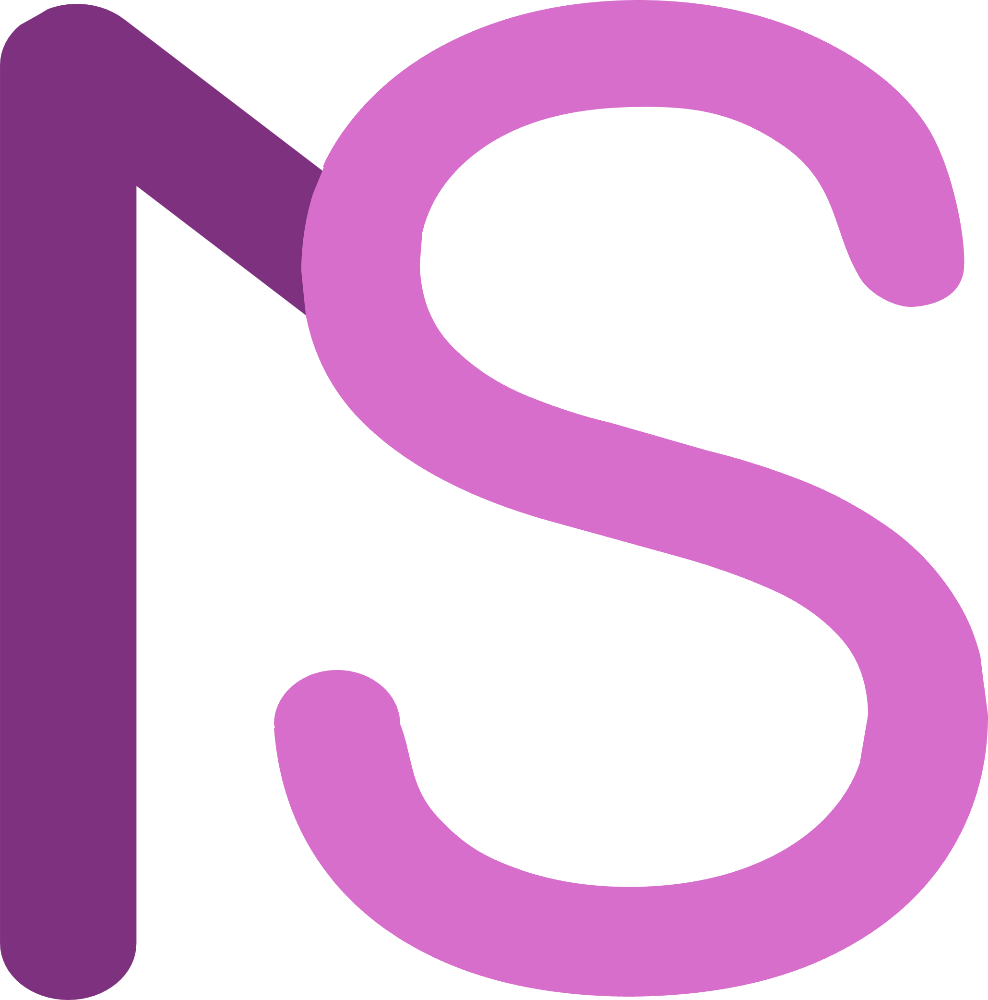

<p align="center">
  
</p>

<h1 align="center">NoteSpace</h1>

<p align="center">
  <strong>노트의 주권을 당신 곁에.</strong><br>
  <em>Your Note on Your Hand.</em>
</p>

<p align="center">
  
  
  
  
  
  
</p>

---

## 📖 소개

**NoteSpace**는 외부 서버, 클라우드 의존성, 회원 가입 없이 내 컴퓨터 안에서 안전하고 완벽하게 구동되는 **독립형 오프라인 데스크톱 지식 관리(PKM) 앱**입니다.

무거운 일렉트론(Electron) 대신 **Tauri v2 + Rust** 기반으로 설계되어 단 **20MB 이내의 초경량 실행 파일**과 **50MB 미만의 메모리(RAM) 효율**을 제공합니다. 

---

## ✨ 핵심 기능

### 🔒 100% 순수 오프라인 & 완전한 데이터 소유권
- 외부 데이터베이스, PHP 백엔드, 클라우드 서버와의 통신이 일절 없습니다.
- 모든 노트와 이미지는 로컬 드라이브의 투명한 폴더(`data/notes/*.md`, `data/images/*.webp`)에 보관됩니다.

### ⚡ 압도적인 초경량 & 초고속 성능
- **20MB** 내외의 단일 실행 파일 (`notespace.exe`)
- 단 **50MB RAM** 수준의 메모리 점유율
- 즉각적인 실행 속도와 부드러운 반응성

### ✍️ 3가지 편집 모드
- **WYSIWYG 블록 에디터**: Tiptap 기반 인터랙티브 편집, 슬래시 커맨드(`/`), 태스크 체크리스트, 드래그 앤 드롭 블록, 커스텀 표(Table), 인라인 하이라이트(형광펜), 접기/펼치기(Details), 탭 블록(TabBlock) 지원.
- **원문 코드 편집 모드**: 개발자와 마크다운 매니아를 위한 직접 텍스트 편집 모드.
- **문서 읽기 모드**: 집중도 높은 깔끔한 독서 환경.

### 🖼️ 고효율 WebP 로컬 이미지 엔진
- 클립보드 복사-붙여넣기(Ctrl+V), 드래그 앤 드롭 시 브라우저 Canvas를 통해 고화질 WebP 규격으로 실시간 자동 압축.
- 마크다운 본문에는 수만 줄의 거대한 Base64 대신 깔끔한 상대 경로 ``만 저장되어 가독성과 파일 경량성 유지.
- 내장 이미지 관리 모달을 통한 갤러리 탐색, 미리보기, 삭제.

### 🌐 네이티브 샌드박스 웹뷰
- 웹 링크 삽입 시 Rust 네이티브 백엔드를 통해 안전하게 HTML 및 OpenGraph 메타데이터(제목, 파비콘, 썸네일)를 추출하여 인라인 카드 및 웹뷰 미리보기 제공.

### 📂 무한 계층 트리 & 고속 인메모리 검색
- `@dnd-kit` 기반의 자유로운 드래그 앤 드롭 폴더/노트 계층 트리 구조.
- 태그 관리(TagManager), 휴지통(Trash) 및 복원/영구 삭제.
- 한글 자소 분리 및 형태소 매칭을 지원하는 초고속 인메모리 클라이언트 검색 엔진.
- 20분 주기 자동 스냅샷(버전 이력 관리) 엔진으로 실수로 인한 데이터 손실 완벽 차단.

### 📦 원클릭 데이터 백업 & 복원
- 버튼 한 번으로 전체 지식 베이스(모든 마크다운 노트, WebP 이미지, 트리 계층 구조, 설정)를 단일 ZIP 파일로 내보내거나 불러올 수 있습니다.

### 🤖 BYOK 기반 AI 어시스턴트
- 사용자가 원하는 경우에만 활성화할 수 있는 생성형 인공지능 API 및 커스텀 AI 엔드포인트 연동 (노트 자동 요약, 문맥 질의응답 지원).

---

## 🗂️ 데이터 저장소 구조 

NoteSpace의 모든 데이터는 표준적인 포맷으로 보관되므로 사용자가 언제든 탐색기에서 직접 확인하고 백업할 수 있습니다.

```text
data/
├── notes/
│   ├── node-1790866666180.md   # 일반 텍스트 표준 마크다운 문서들
│   └── node-1790866875790.md
├── images/
│   ├── img-1790870002523.webp  # 압축된 로컬 WebP 이미지 바이너리
│   └── ...
├── snapshots/                  # 20분 주기 자동 백업 스냅샷
│   └── node-1790866875790/
│       └── 2026-10-02_000116.md
├── hierarchy.json              # 폴더 및 노트 트리 계층 구조
├── images_catalog.json         # 로컬 이미지 메타데이터
├── trash.json                  # 휴지통 보관 목록
└── settings.json               # 테마 및 앱 환경설정
```

---

## 🚀 빠른 시작

### 실행 파일로 즉시 사용

빌드된 단일 실행 파일이 제공됩니다:
- **다운로드 경로**: [`release/notespace.exe`](file:///e:/notespace_neo/release/notespace.exe)
- 설치 과정이나 별도의 런타임(Node.js, Rust 등) 없이 다운로드 후 더블 클릭하면 즉시 실행됩니다.

---

### 소스코드에서 빌드하기

#### 필수 요구사항
- [Node.js](https://nodejs.org/) (v18 이상 권장)
- [Rust](https://www.rust-lang.org/) 및 Cargo 최신 안정 버전
- C++ 빌드 도구 (Windows의 경우 Visual Studio C++ Build Tools)

#### 1. 저장소 클론 및 패키지 설치
```bash
git clone https://github.com/beaniebiin/notespace.git
cd notespace
npm install
```

#### 2. 개발 모드 실행
웹 브라우저 개발 서버 실행:
```bash
npm run dev
```

Tauri 데스크톱 네이티브 창으로 실행:
```bash
npm run tauri dev
```

#### 3. 자동화 테스트 실행
```bash
npm run test:goldens
```

#### 4. 프로덕션 실행 파일 빌드
```bash
# 프론트엔드 빌드 및 Tauri 데스크톱 단일 바이너리 생성
npm run build:app -- --no-bundle
```
빌드가 완료되면 `src-tauri/target/release/notespace.exe` 위치에 단일 바이너리가 생성됩니다.

---

## ⚠️ 유의사항

NoteSpace를 사용하시기 전에 아래 안내 사항을 반드시 숙지해 주시기 바랍니다.

### 1. 1인 개발 오픈소스 프로젝트
본 소프트웨어는 전문 기업의 대규모 상용 제품이 아니며, **로스쿨 학업과 병행하며 1인 개발자가 구축 중인 인디 오픈소스 프로젝트**입니다. 
지속적인 리팩토링과 테스트를 진행하고 있으나, 사용자 운영체제 환경이나 특수한 편집 상황에 따라 **예상치 못한 버그나 불안정성이 발생할 수 있습니다.**

### 2. 철저한 백업
여러분의 소중한 지식과 학습 기록을 지키기 위해 다음 백업 수칙을 실천해 주세요:
- **원클릭 ZIP 백업 활용**: 상단 바 우측 톱니바퀴(설정) ➔ **[전체 파일 내보내기]**를 통해 언제든 전체 노트(`data/notes/`), 이미지(`data/images/`), 계층 구조(`hierarchy.json`)를 단일 ZIP 파일로 내려받을 수 있습니다.
- **분산 보관**: 생성된 백업 ZIP 파일이나 `data/` 디렉터리를 주기적으로 외장 드라이브, 개인 클라우드 스토리지(Google Drive, Dropbox, OneDrive 등)에 보관하시기 바랍니다.
- **자동 스냅샷**: 앱 내부적으로 20분마다 `data/snapshots/`에 이전 버전을 보관하지만, 물리적 드라이브 손상이나 시스템 충돌에 대비한 외부 백업은 필수입니다.

### 3. 법적 면책 조항
- 본 소프트웨어는 **GNU Affero General Public License v3.0 (AGPL-3.0)** 조건에 따라 **"있는 그대로(AS-IS)"** 제공됩니다.
- 상품성, 특정 목적에의 적합성, 무결성 등에 대한 어떠한 명시적 또는 묵시적 보증도 하지 않습니다.
- 본 소프트웨어의 사용, 오류, 작동 중단 또는 데이터 유실로 인해 발생하는 직·간접적 손해에 대해 개발자는 법적 책임을 부담하지 않으므로, 중요한 데이터는 반드시 자체적인 백업 방안을 마련해 두시기 바랍니다.

---


## 🛠️ 기술 스택

| 계층 | 기술 | 설명 |
| :--- | :--- | :--- |
| **Desktop Shell** | [Tauri v2](https://tauri.app/) | 경량 Rust 기반 네이티브 데스크톱 프레임워크 |
| **Frontend Framework** | [React 19](https://react.dev/) + [TypeScript](https://www.typescriptlang.org/) | 최신 동시성 기능 및 엄격한 타입 안정성 |
| **Build Tool** | [Vite 6](https://vitejs.dev/) | 초고속 HMR 및 Rollup 최적화 번들러 |
| **Editor Core** | [Tiptap](https://tiptap.dev/) + [ProseMirror](https://prosemirror.net/) | 확장성 높은 헤드리스 블록 에디터 |
| **Markdown Parser** | `react-markdown`, `remark-gfm`, `tiptap-markdown` | CommonMark 및 GFM 표준 지원 |
| **Styling** | [TailwindCSS v4](https://tailwindcss.com/) + Vanilla CSS | 커스텀 모던 디자인 시스템 & 다크 모드 |
| **Drag & Drop** | `@dnd-kit/core`, `@dnd-kit/sortable` | 직관적인 트리 노드 재정렬 및 이동 |
| **Icons** | [Lucide React](https://lucide.dev/) | 일관되고 세련된 모던 아이콘 세트 |

---

## 📄 라이선스

이 프로젝트는 [GNU Affero General Public License v3.0 (AGPL-3.0)](LICENSE) 라이선스를 따릅니다.
자세한 내용은 [LICENSE](LICENSE) 파일을 참조하세요.

