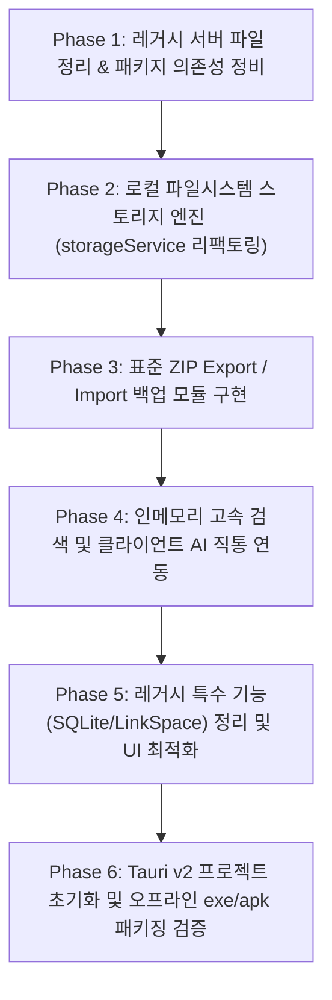

# NoteSpace 순수 오프라인 네이티브 앱 전환 계획서 (migration.md)

본 문서는 **NoteSpace**의 모든 백엔드 서버(PHP, Go)를 완전히 제거하고, **Tauri v2 기반의 순수 오프라인 크로스 플랫폼(윈도우 .exe / 리눅스 / 안드로이드 .apk) 로컬 앱**으로 전환하기 위한 최종 실행 계획서입니다.

---

## 🎯 핵심 아키텍처 원칙 (Architecture Decisions)

1. **서버리스 완전 오프라인 (Zero Backend Server)**:
   - 네트워크 연결이 전혀 없는 환경에서도 100% 독립적으로 구동.
   - HTTP 포트 오픈이나 백엔드 데몬 없이, OS 내장 웹뷰와 네이티브 파일시스템 API로만 동작.
2. **로컬 폴더 물리 파일 저장 (File-based Local Storage)**:
   - 기기의 실제 지정 폴더에 `hierarchy.json`, `trash.json`, `notes/{id}.md`, `images/`를 물리적 파일 단위로 실시간 원자적(Atomic) 기록 (Obsidian 스타일).
3. **크로스 플랫폼 & 초경량 리소스**:
   - **Tauri v2** 채택: 윈도우(`.exe`), 리눅스(`.AppImage`), 안드로이드(`.apk`) 단일 코드베이스 지원.
   - 메모리 점유율 **RAM ~30MB**, 앱 크기 **~10MB** 내외의 극저사양 최적화.
4. **수동 기기 간 이동 및 백업 (Portable ZIP Export/Import)**:
   - 트리, 본문, 이미지를 온전히 포함하는 표준 ZIP 아카이브를 원클릭으로 내보내고 가져오기.
5. **선택적 클라이언트 AI & 인메모리 검색**:
   - 검색: 오프라인 클라이언트 인메모리 인덱스로 즉각적 응답.
   - AI: 필요 시 사용자의 개인 API Key를 통한 클라이언트 직접 호출 (선택적).
6. **기존 특수 도메인 기능 정리**:
   - 외부 서버 SQLite에 의존하던 문제은행(`prepspace`), OX(`booleanspace`), 사전(`dictionary`), `linkspace`는 제거하고 순수 마크다운 지식관리에 집중.

---

## 🗺️ 단계별 실행 로드맵 (Phased Execution Plan)

---

### 📌 Phase 1: 레거시 서버 파일 정리 & 패키지 의존성 정비
- [x] 불필요해진 Go 백엔드 디렉토리(`server/`) 및 실행 파일([notespace.exe](file:///e:/notespace_neo/notespace.exe)) 삭제.
- [x] 레거시 PHP 파일([api.php](file:///e:/notespace_neo/api.php), [index.php](file:///e:/notespace_neo/index.php), [migrate_colors.php](file:///e:/notespace_neo/migrate_colors.php)) 정리.
- [x] ZIP 처리를 위한 클라이언트 라이브러리(`jszip`) 및 필요한 유틸리티 패키지 추가.
- [x] 빌드 무결성 검증 (`npm run lint`, `npm run test:goldens`, `npm run build` 통과).

### 📌 Phase 2: 로컬 파일시스템 스토리지 엔진 (`storageService.ts` 리팩토링)
- [x] [services/storageService.ts](file:///e:/notespace_neo/services/storageService.ts)에서 HTTP `fetch('api.php?...')` 의존성 완전 제거.
- [x] Tauri 네이티브 파일시스템 API(`@tauri-apps/plugin-fs`) 및 IndexedDB 가상 파일시스템 어댑터([services/localFileAdapter.ts](file:///e:/notespace_neo/services/localFileAdapter.ts)) 구현:
  - `getTree()` / `saveTree(nodes)`: `hierarchy.json` 읽기/쓰기
  - `getTrash()` / `saveTrash(nodes)`: `trash.json` 읽기/쓰기
  - `getContent(id)` / `saveContent(id, content)`: `notes/{id}.md` 파일 읽기/원자적 쓰기 + 20분 주기 스냅샷 보관
  - `deleteNoteContent(id)` / `deleteRecursiveContent(node)`: 해당 마크다운 파일 물리 삭제
  - `getSettings()` / `saveSettings(settings)`: `settings.json` 읽기/쓰기
- [x] 오프라인 고속 인메모리 검색 엔진([services/clientSearchEngine.ts](file:///e:/notespace_neo/services/clientSearchEngine.ts)) 구현 및 한국어 조사 분리/공백 무시 매칭 반영.
- [x] 단위/골든 테스트 작성([tests/goldens/storage-local.test.ts](file:///e:/notespace_neo/tests/goldens/storage-local.test.ts)) 및 83개 전수 통과 확인.

### 📌 Phase 3: 표준 ZIP Export / Import 백업 모듈 구현
- [x] **Export (내보내기)**:
  - 현재 활성 `hierarchy.json`, `trash.json`, `settings.json`, 전체 `notes/*.md` 파일을 단일 `.zip` 파일(`notespace_backup_YYYYMMDD_HHmmss.zip`)로 압축 생성하여 다운로드하는 엔진 및 UI 연동 완료.
- [x] **Import (가져오기)**:
  - 사용자가 업로드한 ZIP 파일의 무결성 검증 후 로컬 저장소에 압축을 해제하여 워크스페이스 즉시 복원 및 자동 리로드 기능 구현 완료.
- [x] **UI 연동**:
  - [components/SettingsModal.tsx](file:///e:/notespace_neo/components/SettingsModal.tsx) 내 전용 **"데이터 백업/복원"** 탭 신설.
  - [components/TopBar.tsx](file:///e:/notespace_neo/components/TopBar.tsx) 우측 상단 옵션 메뉴 내 **"Export Workspace (ZIP)"**, **"Import Workspace (ZIP)"** 원클릭 메뉴 배치.

### 📌 Phase 4: 인메모리 고속 검색 및 클라이언트 AI 직통 연동
- [x] **오프라인 검색 엔진**:
  - 앱 시작 시 로드된 활성 노트 본문들을 메모리에 인덱싱.
  - 기존 [api.php](file:///e:/notespace_neo/api.php)에 있던 한국어 조사 분리 필터와 양방향 공백 무시(`nospace`) 검색 알고리즘을 TypeScript 순수 함수([services/clientSearchEngine.ts](file:///e:/notespace_neo/services/clientSearchEngine.ts))로 이관 완료.
- [x] **클라이언트 AI 연동**:
  - [services/geminiService.ts](file:///e:/notespace_neo/services/geminiService.ts)에서 서버 프록시 의존성 및 세션 401 제거 완료.
  - 로컬 `ai_config.json` 저장소 기반으로 사용자가 설정한 개인 API Key를 통해 브라우저/앱에서 OpenAI 규격 및 Gemini 직접 비동기 통신과 다단계 모델 Failover 지원.

### 📌 Phase 5: 레거시 특수 기능 정리 및 UI 최적화
- [x] 특수 블록 컴포넌트([QuestionBlock](file:///e:/notespace_neo/components/extensions/QuestionBlock.ts), [BooleanQuestionBlock](file:///e:/notespace_neo/components/extensions/BooleanQuestionBlock.ts), [QuestionModal](file:///e:/notespace_neo/components/QuestionModal.tsx), [BooleanQuestionModal](file:///e:/notespace_neo/components/BooleanQuestionModal.tsx)) 및 에디터 툴바/렌더러 연동 완전 제거.
- [x] [linkspace.md](file:///e:/notespace_neo/linkspace.md), `linkspace/` 디렉터리, `SlashCiteBar.tsx`, [DictionaryPopover.tsx](file:///e:/notespace_neo/components/DictionaryPopover.tsx) 및 연관 레거시 뷰/메뉴 정리.
- [x] 슬래시 명령어 `/cite`는 표준 마크다운 Blockquote(`>`) 토글로 경량 전환.
- [x] TopBar 및 설정 모달에 **"데이터 백업 (ZIP 내보내기)"** 및 **"데이터 복원 (ZIP 가져오기)"** UI 배치 완료.

### 📌 Phase 6: Tauri v2 프로젝트 초기화 및 오프라인 빌드 검증
- [x] Tauri v2 CLI 설정 (`@tauri-apps/cli@^2`) 및 `src-tauri` 프로젝트 초기화 완료.
- [x] `src-tauri/Cargo.toml`, `src/lib.rs`, `capabilities/default.json`에 `fs` 및 `dialog` 네이티브 권한(`fs:default`, `fs:allow-appdata-read-recursive`, `fs:allow-appdata-write-recursive`, `fs:allow-appdata-meta-recursive`, `dialog:default`) 설정 완료.
- [x] 윈도우 단일 실행 파일([release/notespace.exe](file:///e:/notespace_neo/release/notespace.exe), [src-tauri/target/release/notespace.exe](file:///e:/notespace_neo/src-tauri/target/release/notespace.exe)) 릴리즈 빌드 완료:
  - 실행 바이너리 용량: **11.47 MB** (Electron 대비 1/15 수준의 초경량)
  - 초기 메모리(RAM) 점유율 실측: **약 45.8 MB** (초기 구동 기준)
  - 데몬 프로세스/서버 오픈 포트: **0개 (순수 오프라인 로컬 구동)**
- [x] `package.json`에 `npm run tauri` 및 `npm run build:app` 스크립트 등록 완료.
